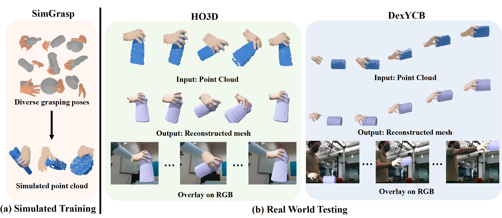

# [AAAI 2023] Tracking and Reconstructing Hand Object Interactions from Point Cloud Sequences in the Wild



## Introduction

This is the PyTorch implementation of our paper [Tracking and Reconstructing Hand Object Interactions from Point Cloud Sequences in the Wild](https://arxiv.org/abs/2209.12009). 
For more information, please visit our [project page](https://pku-epic.github.io/HOtrack/).


## Installation

+ Our code has been tested with
  + Ubuntu 20.04
  + CUDA 11.7
  + Python 3.8
  + PyTorch 1.9.1 (NOTE: PyTorch version should <1.11 to compile CUDA code in ```pointnet_lib```)

+ We recommend using [Anaconda](https://www.anaconda.com/) to create an environment, by running the following:

  ```bash
  conda env create -n hotrack python=3.8
  conda activate hotrack
  ```

+ Install pytorch and other dependencies.

  ```bash
  # Just an example for pytorch. Please visit https://pytorch.org/ for more.
  pip install torch==1.9.1+cu111 torchvision==0.10.1+cu111 torchaudio==0.9.1 -f https://download.pytorch.org/whl/torch_stable.html
  pip install -r requirements.txt
  ```

+ Compile the CUDA code for PointNet++ backbone.

  ```bash
  cd network/models/pointnet_lib
  python setup.py install
  ```


## Dataset

+ Download MANO pickle data-structures and save it to ```third_party/mano/models``` following [Manopth](https://github.com/hassony2/manopth#download-mano-pickle-data-structures). You also need to install [Manopth](https://github.com/hassony2/manopth) if you want to play with DexYCB dataset.

+ Download our SimGrasp dataset ```SimGrasp.zip``` and our pretrained models ```pretrained_models.zip``` from [here](https://mirrors.pku.edu.cn/dl-release/HOTrack_AAAI2023/). Note that ```SimGrasp_rawimg.zip``` is not necessary for training and testing, which contains raw RGB and depth images of our dataset. 

+ Download HO3D dataset (version 3) from [their official website](https://cloud.tugraz.at/index.php/s/z8SCsWCYM3YcQWX?).  

+ Download DexYCB dataset from [their official website](https://dex-ycb.github.io/).

+ Link ```data``` to the path of your dataset
  ```bash
   ln -s ${DATAFOLDER} data 
  ```

### Dataset Folder Structure

<details>
<summary><b>See here for the organization of dataset folders.</b> </summary> 
<p>

```bash
  data
  ├── SimGrasp
  │   ├── img # raw RGB and depth from SimGrasp_rawimg.zip, which is not necessary in training and testing
  │   ├── objs  # in SimGrasp.zip
  │   ├── masks # in SimGrasp.zip
  │   ├── preproc # in SimGrasp.zip
  │   ├── splits  # in SimGrasp.zip
  │   └── SDF # in pretrained_models.zip
  ├── YCB
  │   ├── CatPose2InsPose.npy  # in pretrained_models.zip
  │   ├── models # Download from the DexYCB dataset
  │   └── SDF # in pretrained_models.zip
  ├── HO3D
  │   ├── calibration
  │   ├── train # include both HO3D_v3.zip and HO3D_v3_segmentations_rendered.zip
  │   ├── splits  # in pretrained_models.zip
  │   └── SDF # in pretrained_models.zip
  ├── DexYCB 
  │   ├── 20200709-subject-01
  │   ├── ...
  │   ├── 20201022-subject-10
  │   ├── calibration
  │   ├── splits  # in pretrained_models.zip
  │   └── SDF  # in pretrained_models.zip
  └── exps	# in pretrained_models.zip			
  ```
</p>

Note that we use [Curriculum-DeepSDF](https://github.com/haidongz-usc/Curriculum-DeepSDF) to initialize SDF models for objects taking as input the observed point clouds at frame 0 of each testing trajectories. If you only want to use our pretrained SDF models, you don't have to install Curriculum-DeepSDF.

</details>


## Running
  
+ To train HandTrackNet. The test results reported during training is based on single-frame instead of tracking a sequence.
  ```bash
    CUDA_VISIBLE_DEVICES=0 python network/train.py --config handtracknet_train_SimGrasp.yml
  ```

+ To track hand using HandTrackNet in a sqeuence.
  ```bash
    CUDA_VISIBLE_DEVICES=0 python network/test.py --config handtracknet_test_SimGrasp.yml --num_worker 0
  ```

+ Our full pipeline.
  ```bash
    CUDA_VISIBLE_DEVICES=0 python network/test.py --config objopt_test_HO3D.yml --num_worker 0 --save # 1. track object and save results
    CUDA_VISIBLE_DEVICES=0 python network/test.py --config handopt_test_HO3D.yml --num_worker 0 # 2. track hand using saved object pose
  ```


## Citation

If you find our work useful in your research, please consider citing:

```
@article{chen2022tracking,
  title={Tracking and Reconstructing Hand Object Interactions from Point Cloud Sequences in the Wild},
  author={Chen, Jiayi and Yan, Mi and Zhang, Jiazhao and Xu, Yinzhen and Li, Xiaolong and Weng, Yijia and Yi, Li and Song, Shuran and Wang, He},
  journal={arXiv preprint arXiv:2209.12009},
  year={2022}
}
```

## License

 This work and the dataset are licensed under [CC BY-NC 4.0][cc-by-nc].

 [![CC BY-NC 4.0][cc-by-nc-image]][cc-by-nc]

 [cc-by-nc]: https://creativecommons.org/licenses/by-nc/4.0/
 [cc-by-nc-image]: https://licensebuttons.net/l/by-nc/4.0/88x31.png

<!-- 
## SimGrasp generation
+ Follow instructions to install [the melodic version of ROS](http://wiki.ros.org/melodic/Installation) + [graspit interface](https://github.com/graspit-simulator/graspit_interface) + [mano_grasp](https://github.com/lwohlhart/mano_grasp)
  + **Note** that **graspit** only support **melodic** version of ROS on ubuntu **18.04**

+ NOCS dataset: [Download from the original NOCS dataset](https://github.com/hughw19/NOCS_CVPR2019#datasets): 

  ```
  python cp_nocs_objs.py -c bottle      #first copy the obj files for prepare_objects. It will also resize the objects to be like in real.
  cd mano_grasp/mano_grasp
  python prepare_objects.py --models_folder /home/hewang/Desktop/data/jiayi/h2o_data/objs/bottle --file_out NOCS_bottle.txt  --scales 1000
  roslaunch graspit_interface graspit_interface.launch   #in another cmd
  python generate_grasps.py --models_file NOCS_bottle.txt --path_out /home/hewang/Desktop/data/jiayi/h2o_data/grasps/bottle -n 30 -g 10
  
  cd preproc_grasps_data
  python remove_duplicate_grasp.py -c bottle
  python save_hand_mesh -c bottle
  python my_render.py -c bottle
  ```
   -->


